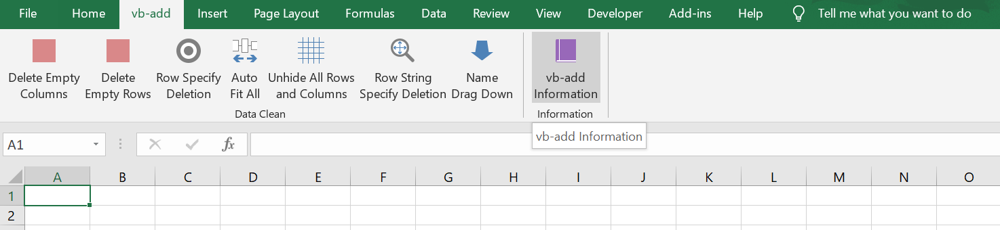

# vb-add
**A Microsoft Excel Add-in to automate business processes**

## Overview

This is a repository for an Excel Add-in application called vb-add. To checkout the code, `Module1.bas` contains all subroutines relating to data manipulation/filtering and `Module2.bas` contains a subroutine to display the application's information. Essentially to add this to the ribbon you import the Modules, create a tab/group in your ribbon, and append the subroutines to it.

## Installation

- Clone this repository
- Open an Excel workbook
- Press Alt+F11 while in that Excel workbook
- Right click in the project manager on the left side and click 'Import File'
- Import `Module1.bas` and `Module2.bas`
- Go back to the Excel workbook and right click the ribbon and click 'Customize the Ribbon'
- From the 'Choose commands from:' dropdown, select 'Macros'
- Click 'New Tab'
- Add all subroutines from `Module1.bas` and `Module2.bas` into that Tab/Group that was created.
- Add the repository to Trusted Locations in the Trust Center Settings
